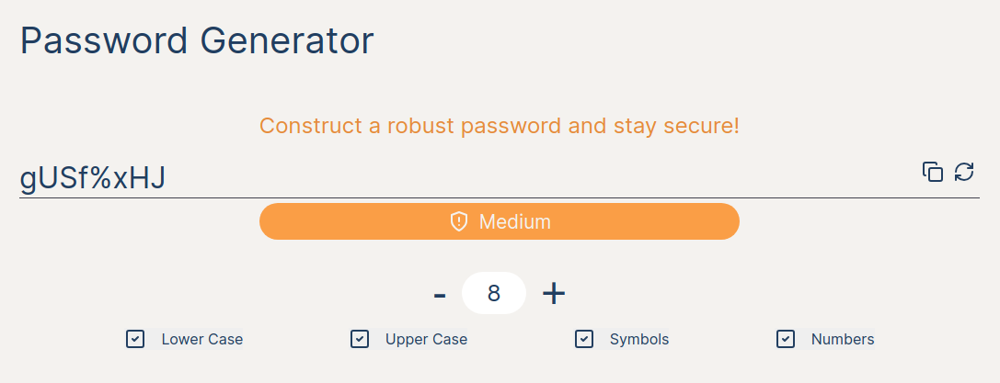

## Purpose

This project was done as part of the study of some technologies listed below.

## Demo

## Project Features
1. User can choose the password length.
2. User can choose which filters to use in password creation:
-  Uppercase letters
-  Lowercase letters
-  Symbols
-  Numbers
3. User can repeat the password generation indefinitely.
4. User can copy the generated password to the clipboard with one click.
5. User can view the strength of the generated password.

## Technical Specifications
* [React@Next.JS](https://nextjs.org)
* Typescript
* [styled-components](https://styled-components.com) for styling

### Setup

**Install Dependencies**

`npm install`

**Run Application**

`npm run dev`